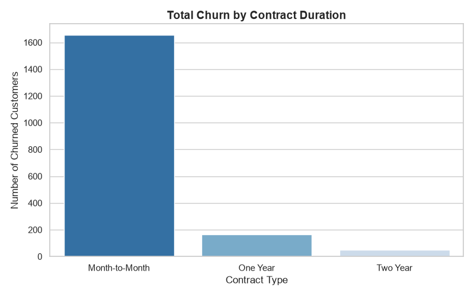
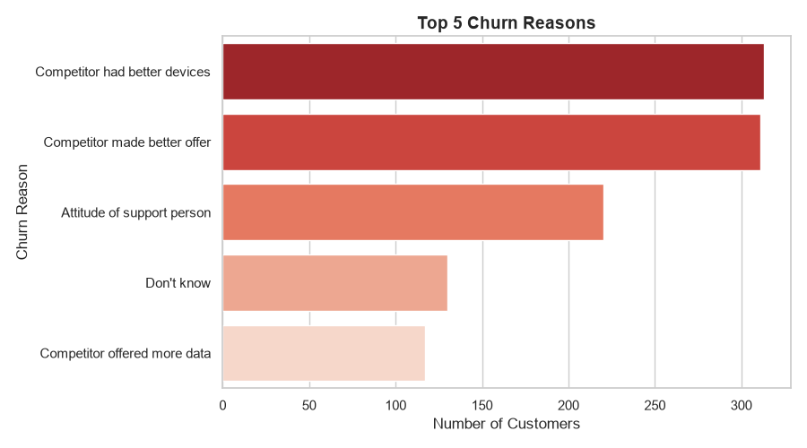
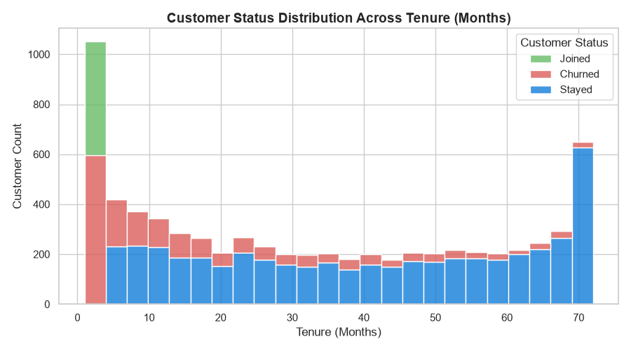

# Telecom Customer Cancellation & Retention Analysis

A comprehensive data analytics capstone project examining customer cancellation patterns, churn drivers, and retention opportunities for a telecommunications provider using Q2 2022 dataset.

---

## Executive Summary

Customer churn directly impacts recurring revenue and long-term business growth. This project analyzes **7,043 customer records** to uncover why customers cancel their services, which customer segments are at the highest risk, and what targeted interventions can maximize retention.

### Key Performance Indicators (KPIs)
* **Total Customers Analyzed**: 7,043
* **Overall Churn Rate**: **26.54%** (1,869 churned customers)
* **Primary Churn Segment**: Month-to-Month contract holders (**88.5%** of all cancellations)
* **Top Attrition Causes**: Competitor device offerings, competitor pricing, and support staff interaction quality.

---

## Key Insights & Findings

### 1. High-Risk Segments & Contract Impact
* **Month-to-Month Vulnerability**: Customers on **Month-to-Month** contracts represent the vast majority of churned customers (1,655 out of 1,869 churns), whereas customers on One-Year (166) and Two-Year (48) contracts demonstrate significantly higher loyalty.
* **Early Tenure Drop-off**: Over **55% of total cancellations** occur within the first 12 months of tenure. Churn risk decreases substantially after a customer reaches 24 months.

### 2. Service Add-ons & Anchor Products
* **Online Security Protection**: Customers **without Online Security** experienced a **41.77% churn rate**, compared to just **14.61%** for customers who subscribed to Online Security. Service add-ons serve as strong retention anchors.

### 3. Primary Reasons for Customer Churn
1. **Competitor Offerings**: 624 total customers churned due to competitors having better devices or better promotional offers.
2. **Customer Support Experience**: **220 customers** cited the attitude of support staff as their primary reason for leaving. This issue accounts for **13.35% of lost revenue** among Month-to-Month subscribers.

---

## Visualizations

The generated visualizations provide a clear picture of customer churn trends across contract types, tenure, and churn drivers:

| Total Churn by Contract Duration | Top 5 Churn Reasons |
| :---: | :---: |
|  |  |

### Customer Status Across Tenure


---

## Data-Driven Recommendations

1. **First-Year Retention Incentives**: Implement proactive onboarding touchpoints and early tenure discount incentives during months 1–12 to stabilize high early-stage drop-off.
2. **Bundle Anchor Services**: Offer **Online Security** and technical protection plans as default or discounted add-ons during sign-up to increase product stickiness.
3. **Contract Migration Campaigns**: Create target promotions converting Month-to-Month subscribers into One-Year plans, offering a minor discount in exchange for commitment.
4. **Customer Service Audit**: Introduce specialized retrain programs for frontline support agents, particularly focusing on resolving Month-to-Month customer queries constructively.

---

## Project Repository Structure

```text
telecom-customer-churn-analysis/
├── README.md                           <- Executive summary & project documentation
├── LICENSE                             <- Project license (MIT)
├── data/
│   └── C1_Capstone_Customer_cancellation_analysis.xlsx  <- Raw dataset
├── notebooks/
│   └── customer_churn_analysis.ipynb   <- Data extraction, analysis & chart generation
└── visuals/
    ├── churn_by_contract.png           <- Generated visualization
    ├── churn_reasons.png               <- Generated visualization
    └── tenure_vs_churn.png             <- Generated visualization
Tools & Libraries Used
Python 3.10+: Core programming language

Pandas & NumPy: Data cleaning, manipulation, and statistical aggregation

Matplotlib & Seaborn: Data visualization and visual export

OpenPyXL: Processing Excel workbooks within Python

VS Code / Jupyter Notebook: Exploratory environment

Git & GitHub: Version control and portfolio hosting
